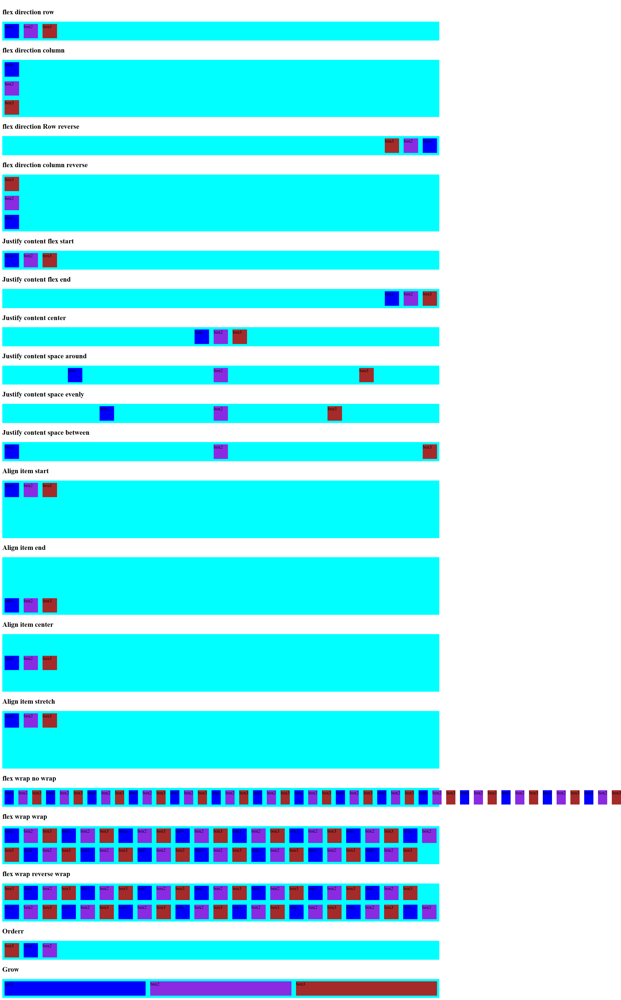

# CSS-Flex-Box

**Learning and practicing CSS Flexbox with real layout examples.**

📦 Flexbox Properties  
🔹 flex-direction

Defines direction of flex items:

1.row

2.row-reverse

3.column

4.column-reverse

🔹 justify-content

Aligns items horizontally (main axis):

1.flex-start

2.flex-end

3.center

4.space-between

5.space-around

6.space-evenly

🔹 align-items

Aligns items vertically (cross axis):

1.flex-start

2.flex-end

3.center

4.stretch

baseline

🔹 flex-wrap

Controls wrapping of items:

1.nowrap

2.wrap

3.wrap-reverse

🔹 order

Controls item order:

order: number; (default is 0)

🔹 flex-grow

Controls how much item grows:

flex-grow: number; (default is 0)

# Image📷

